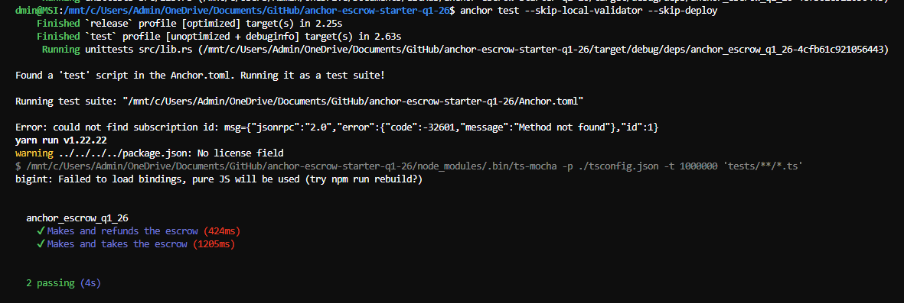

# Escrow Program (Anchor)

## Submission
- GitHub Repo: [https://github.com/Sunilkumarchavhan9/week-4-assignment](https://github.com/Sunilkumarchavhan9/week-4-assignment)

## Objective
Create an Escrow Program using Anchor.

## What Was Done
1. Initialized an Anchor program.
2. Implemented all escrow instructions:
   - `make`
   - `take`
   - `refund`
3. Wrote integration tests for each instruction flow in `tests/anchor-escrow-q1-26.ts`.

## Program Files
- `programs/anchor-escrow-q1-26/src/instructions/make.rs`
- `programs/anchor-escrow-q1-26/src/instructions/take.rs`
- `programs/anchor-escrow-q1-26/src/instructions/refund.rs`
- `programs/anchor-escrow-q1-26/src/lib.rs`

## Tests
- Command used:
  - `anchor test --skip-local-validator --skip-deploy`
- Passing scenarios:
  - Makes and refunds the escrow
  - Makes and takes the escrow

## Screenshot (Tests Passing)

